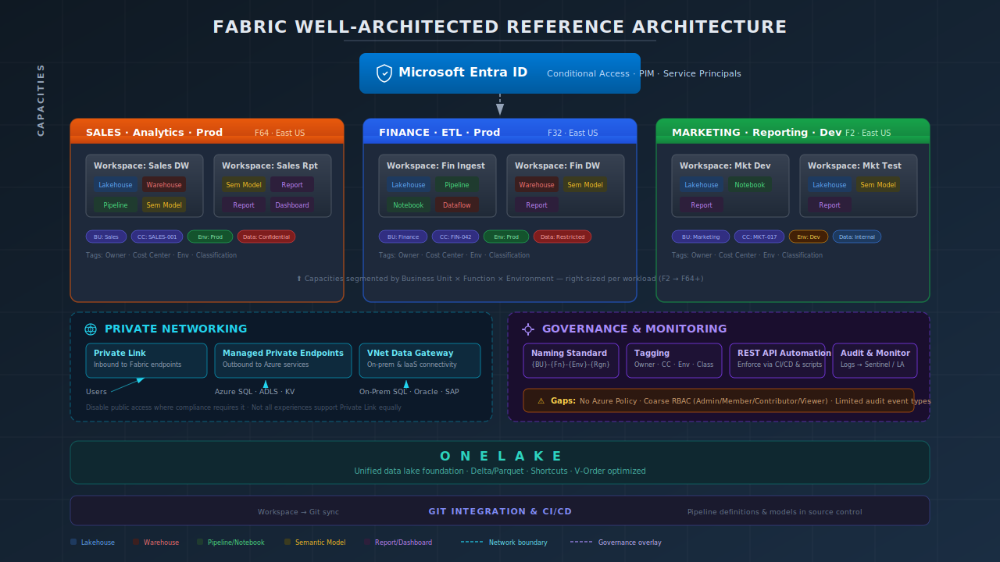

# FabricWAF

Terraform and governance standards for deploying Microsoft Fabric capacities on Azure in a well-architected, policy-enforced manner.

## Reference Architecture



## Contents

```
FabricWAF/
├── .github/workflows/
│   └── fabric-prod-deploy.yml    # Validate + deploy gate for production workspaces
├── scripts/
│   ├── validate_fabric.py        # Naming and security validation against prod workspaces
│   ├── deploy_fabric.py          # Triggers Fabric Deployment Pipeline and polls for completion
│   ├── audit_fabric.py           # Tenant-wide compliance audit with email reporting
│   └── create-bad-workspaces.py  # Demo script — generates 100 badly-named workspaces
├── audit-report.json             # Example audit output — 185 violations across 158 workspaces
├── naming-standard.md            # Naming conventions for all Fabric resources
├── reference-architecture.md     # Architecture narrative and component breakdown
├── reference-architecture.svg    # Architecture diagram
└── terraform/
    ├── providers.tf               # AzureRM + AzureAD provider configuration
    ├── variables.tf               # Input variables with built-in validation
    ├── main.tf                    # Fabric capacity resource + required tags
    ├── policy.tf                  # Azure Policy definitions, assignments, RBAC role, and initiative
    ├── github-runner-identity.tf  # Managed identity for the fabric-gh-runner VM
    └── outputs.tf                 # Resource ID outputs
```

## Prerequisites

- Terraform >= 1.6.0
- AzureRM provider >= 4.0.0
- AzureAD provider >= 2.47.0
- An Entra security group named `Fabric-Capacity-Admins` (or set via `fabric_admins_group_name`)
- Azure subscription with permissions to create:
  - `Microsoft.Fabric/capacities`
  - `Microsoft.Authorization/policyDefinitions`
  - `Microsoft.Authorization/policyAssignments`
  - `Microsoft.Authorization/policySetDefinitions`
  - `Microsoft.Authorization/roleDefinitions`
  - `Microsoft.Authorization/roleAssignments`

## Usage

**1. Authenticate to Azure**

```bash
az login
az account set --subscription "<subscription-id>"
```

**2. Create a `terraform.tfvars` file**

```hcl
resource_group_name      = "rg-fabric-prod"
location                 = "eastus"
capacity_name            = "fin-dw-prod-eus"
sku_name                 = "F8"
fabric_admins_group_name = "Fabric-Capacity-Admins"
cost_center              = "CC-1234"
created_by               = "platform-team@contoso.com"
created_date             = "2026-03-18"
policy_scope             = "/subscriptions/<subscription-id>"
```

**3. Deploy**

```bash
cd terraform
terraform init
terraform plan
terraform apply
```

## Fabric Capacity

The `azurerm_fabric_capacity` resource is created with the SKU you provide. Administration is locked to the `Fabric-Capacity-Admins` Entra group — the group's object ID is resolved at plan time via the `azuread` provider and set as the only `administration_members` entry.

Three tags are required on every capacity:

| Tag | Description |
|-----|-------------|
| `costCenter` | Cost center code for billing attribution |
| `createdDate` | ISO 8601 date the capacity was provisioned (`YYYY-MM-DD`) |
| `createdBy` | UPN or service principal that deployed the capacity |

Additional tags can be passed via `additional_tags`.

### Available SKUs

`F2` `F4` `F8` `F16` `F32` `F64` `F128` `F256` `F512` `F1024` `F2048`

## Azure Policies

Three custom policy definitions are deployed and bundled into the `fabric-capacity-governance` initiative.

### Policy 1 — US Regions Only

Denies `Microsoft.Fabric/capacities` deployments outside of US Azure regions.

Allowed regions: `eastus`, `eastus2`, `westus`, `westus2`, `westus3`, `centralus`, `northcentralus`, `southcentralus`, `westcentralus`

### Policy 2 — Naming Standard

Denies capacity names that do not match the naming pattern defined in [naming-standard.md](naming-standard.md):

```
{BU}-{Function}-{Env}-{Region}
```

| Token | Allowed values |
|-------|---------------|
| `{BU}` | `fin` `mktg` `hr` `eng` `sales` `ops` |
| `{Function}` | `dw` `analytics` `ingest` `ml` `report` |
| `{Env}` | `dev` `tst` `stg` `prod` |
| `{Region}` | `eus` `eus2` `wus` `wus2` `wus3` `cus` `ncus` `scus` `wcus` |

**Examples:** `fin-dw-prod-eus`, `eng-ml-stg-wus2`, `sales-analytics-dev-eus2`

The same regex is enforced locally in `variables.tf`, so `terraform plan` will catch a non-compliant name before it reaches Azure.

### Policy 3 — Admin Group Enforcement

Denies any capacity whose `administrationMembers` contains anyone other than the `Fabric-Capacity-Admins` Entra group. The policy triggers a `Deny` if either condition is true:

- Any member in the array is **not** the approved group's object ID
- The approved group is **absent** from the array entirely

This prevents ad-hoc individuals or other groups from being set as capacity admins through the portal or any other path.

## RBAC — Fabric Capacity Administrator Role

A custom Azure role (`Fabric Capacity Administrator`) is created and assigned exclusively to the `Fabric-Capacity-Admins` group at the policy scope. The role grants only the Fabric-specific actions needed to manage capacities:

| Action | Purpose |
|--------|---------|
| `Microsoft.Fabric/capacities/read` | View capacity |
| `Microsoft.Fabric/capacities/write` | Create or update capacity |
| `Microsoft.Fabric/capacities/delete` | Delete capacity |
| `Microsoft.Fabric/capacities/resume/action` | Resume a paused capacity |
| `Microsoft.Fabric/capacities/suspend/action` | Pause a running capacity |

> **Note:** If `Owner` or `Contributor` are already assigned at the subscription scope, those roles also carry `capacities/write`. Review existing broad role assignments and scope them down as needed — the custom role and policy together enforce intent, but broad roles at higher scopes can bypass the RBAC restriction. The Policy 3 `Deny` will still catch any capacity created with a non-compliant admin list regardless of who created it.

## Tenant-Wide Compliance Audit (`audit_fabric.py`)

`scripts/audit_fabric.py` performs a full sweep of the entire tenant and emails results to the admin and to each workspace's Admin-role members.

### What it checks

| Check | Scope | Severity |
|-------|-------|----------|
| Capacity deployed outside a US Azure region | Every capacity found via Resource Graph | High |
| Workspace name doesn't match `{BU}-{Function}-{Env}` | Every workspace | Medium |
| Individual `User` account holds Admin/Member/Contributor | Every workspace | High |
| Item name doesn't match the pattern for its type | Every item in every workspace | Medium |

### How it authenticates

Three token scopes, all via `DefaultAzureCredential` (managed identity on `fabric-gh-runner`):

| Scope | Used for |
|-------|----------|
| `management.azure.com` | Azure Resource Graph — scan all Fabric capacities across subscriptions |
| `api.fabric.microsoft.com` | Fabric Admin API — list workspaces, items, and role assignments |
| `graph.microsoft.com` | Resolve user/group display names and email addresses for the report |

The managed identity needs:
- `Reader` on the subscriptions to query (for Resource Graph)
- Fabric tenant admin role (to use `/admin/workspaces`)
- `User.Read.All` and `Group.Read.All` Microsoft Graph application permissions

### Who receives email

- **Admin** (`EMAIL_ADMIN`) — receives the full HTML report covering all capacities and workspaces
- **Workspace Admins** — each Admin-role member of a non-compliant workspace receives a scoped report showing only their workspace's violations

### Configuration

| Variable | Description |
|----------|-------------|
| `SMTP_HOST` | SMTP server (e.g. `smtp.office365.com`) |
| `SMTP_PORT` | SMTP port — default `587` |
| `SMTP_USER` | SMTP username |
| `SMTP_PASSWORD` | SMTP password |
| `EMAIL_FROM` | Sender address |
| `EMAIL_ADMIN` | Admin recipient — always gets the full report |
| `EMAIL_DRY_RUN` | Set to `true` to print emails to stdout instead of sending |
| `REPORT_PATH` | JSON output path — default `audit-report.json` |

### Usage

```bash
pip install azure-identity requests

# Full audit + send emails
python scripts/audit_fabric.py

# Preview emails without sending
python scripts/audit_fabric.py --dry-run

# Write JSON report only, no email
python scripts/audit_fabric.py --report-only
```

Progress is reported as a live bar rather than per-workspace output. The summary and any violation details appear after the scan completes.

### API throttling

The Fabric Admin API enforces per-user per-endpoint rate limits and will return `429 Too Many Requests` when scanning large tenants. When this happens the script prints the `Retry-After` value it received and waits before retrying — expect output like:

```
[429] Throttled by Fabric API (attempt 1/3) — waiting 55s ... (total throttles so far: 1)
```

After three consecutive 429s on an endpoint the script falls back to the member-scoped equivalent (e.g. `/workspaces/{id}/roleAssignments` instead of `/admin/workspaces/{id}/users`). If both are throttled the workspace is skipped and the total throttle count is shown in the summary.

**Tips for avoiding throttling:**

- **Run off-peak.** The Fabric Admin API quota is per-user per time window. Scheduling the audit overnight or outside business hours gives the quota time to reset between attempts.
- **Don't run concurrent scans.** Multiple simultaneous audit runs share the same per-user quota and will throttle each other immediately.
- **Expect longer runtimes on large tenants.** A tenant with 150+ workspaces may take 10–20 minutes if the API throttles and the script must wait on `Retry-After` intervals. This is normal — do not kill and restart, as that resets progress without resetting the quota window.
- **Check capacity utilisation.** If the Fabric capacity itself is near its CU limit, API calls compete with running workloads. Pausing or scaling the capacity before running the audit can reduce throttling.

To run on a schedule, add it as a cron job on the `fabric-gh-runner` VM or trigger it from a separate GitHub Actions workflow on a `schedule` event.

### Example output

[`audit-report.json`](audit-report.json) is a real report generated against this tenant. It illustrates exactly what ungoverned Fabric environments accumulate over time — and why the naming standard and deployment gate exist:

```json
{
  "summary": {
    "capacities_scanned": 1,
    "capacity_region_violations": 0,
    "workspaces_scanned": 158,
    "items_scanned": 40,
    "naming_violations": 185,
    "security_violations": 0,
    "total_violations": 185
  }
}
```

185 naming violations across 158 workspaces — every one of them preventable with the standards in this repo applied from day one.

## GitHub Actions — Production Deployment Gate

Because Fabric has no built-in policy engine, a GitHub Actions workflow running on a self-hosted runner enforces naming and security standards as a hard gate before anything reaches production.

### How it works

```
PR → validate job → PR comment with results
main push → validate job → (approval) → deploy job → post-deploy smoke check
```

1. **Every PR** runs `scripts/validate_fabric.py` against all `*-prod` workspaces and posts results as a PR comment. A failing check blocks merge.
2. **Every push to `main`** re-validates, then waits for manual approval via the `production` GitHub Environment before triggering the Fabric Deployment Pipeline.
3. **After deploy**, validation runs again as a smoke check.

### Self-hosted runner & authentication

The workflow runs on a self-hosted runner — an Azure VM named `fabric-gh-runner`. The VM has a user-assigned managed identity (`id-fabric-gh-runner`) provisioned by `terraform/github-runner-identity.tf`. The Python scripts use `DefaultAzureCredential`, which transparently picks up the managed identity — no secrets or OIDC tokens are stored in GitHub.

### What is validated

**Naming standards** (`scripts/validate_fabric.py`)

Every item in every `*-prod` workspace is checked against the regex pattern for its type, derived from [naming-standard.md](naming-standard.md):

| Item type | Pattern |
|-----------|---------|
| Lakehouse | `lh_{BU}_{Layer}_{Env}` |
| Warehouse | `wh_{BU}_{Function}_{Env}` |
| DataPipeline | `pl_{BU}_{Source}_to_{Layer}_{Freq}` |
| Dataflow Gen2 | `df_{BU}_{Source}_{Domain}_{Layer}` |
| Notebook | `nb_{BU}_{Function}_{Domain}` |
| SparkJobDefinition | `sj_{BU}_{Function}_{Domain}_{Freq}` |
| SemanticModel | `sm_{BU}_{Domain}_{Env}` |
| Report | `rpt_{BU}_{Domain}_{Audience}` |
| PaginatedReport | `prpt_{BU}_{Domain}_{Description}` |
| KQLDatabase | `kql_{BU}_{Domain}_{Env}` |
| MLModel | `mdl_{BU}_{Domain}_{Version}` |
| Environment | `env_{BU}_{Purpose}_{Env}` |

**Security posture**

Any individual `User` account holding `Admin`, `Member`, or `Contributor` on a prod workspace is flagged as a violation. Only Entra groups and service principals should hold write-level roles in production.

### Setup

**1. GitHub Actions variables** (repo Settings → Variables)

| Variable | Description |
|----------|-------------|
| `FABRIC_DEPLOYMENT_PIPELINE_ID` | GUID of the Fabric Deployment Pipeline |
| `FABRIC_SOURCE_STAGE_ORDER` | Stage index to promote from (e.g. `1` for staging) |
| `FABRIC_TARGET_STAGE_ORDER` | Stage index to promote to (e.g. `2` for production) |

**2. GitHub Environment**

Create a `production` environment in repo Settings → Environments and add required reviewers. The deploy job will not run until a reviewer approves.

**3. Runner registration**

Register the `fabric-gh-runner` VM as a self-hosted runner with the label `fabric-gh-runner` in repo Settings → Actions → Runners.

**4. Grant runner identity access to prod workspaces**

After running `terraform apply`, use the `gh_runner_identity_principal_id` output to add the managed identity as a `Contributor` on each prod workspace via the Fabric Admin API or portal:

```bash
PRINCIPAL_ID=$(terraform -chdir=terraform output -raw gh_runner_identity_principal_id)

curl -X POST "https://api.fabric.microsoft.com/v1/workspaces/{workspaceId}/roleAssignments" \
  -H "Authorization: Bearer <token>" \
  -H "Content-Type: application/json" \
  -d "{\"role\":\"Contributor\",\"principal\":{\"id\":\"$PRINCIPAL_ID\",\"type\":\"ServicePrincipal\"}}"
```

> **Why `ServicePrincipal` type for a managed identity?** From Fabric's perspective, a managed identity is a service principal in Entra ID — use `ServicePrincipal` as the principal type in all Fabric API calls.

## Naming Standard

See [naming-standard.md](naming-standard.md) for the full naming convention covering all Fabric resource types: capacities, workspaces, lakehouses, warehouses, pipelines, notebooks, semantic models, and more.

## Variables Reference

| Variable | Type | Default | Description |
|----------|------|---------|-------------|
| `resource_group_name` | `string` | — | Resource group for the Fabric capacity |
| `location` | `string` | `eastus` | Azure region (US regions only) |
| `capacity_name` | `string` | — | Name following `{BU}-{Function}-{Env}-{Region}` |
| `sku_name` | `string` | `F2` | Fabric capacity SKU |
| `fabric_admins_group_name` | `string` | `Fabric-Capacity-Admins` | Display name of the Entra security group for capacity administration |
| `cost_center` | `string` | — | Cost center tag value |
| `created_by` | `string` | — | Created-by tag value |
| `created_date` | `string` | `2026-03-18` | Created-date tag value (`YYYY-MM-DD`) |
| `additional_tags` | `map(string)` | `{}` | Extra tags merged with required tags |
| `policy_scope` | `string` | — | ARM ID of the subscription or management group for policy assignment and role assignment |

## Outputs

| Output | Description |
|--------|-------------|
| `fabric_capacity_id` | Resource ID of the Fabric capacity |
| `fabric_capacity_name` | Name of the Fabric capacity |
| `fabric_admins_group_object_id` | Object ID of the resolved `Fabric-Capacity-Admins` Entra group |
| `us_regions_policy_id` | Resource ID of the US-regions-only policy definition |
| `naming_standard_policy_id` | Resource ID of the naming-standard policy definition |
| `admin_group_policy_id` | Resource ID of the admin-group-only policy definition |
| `fabric_capacity_admin_role_id` | Resource ID of the custom Fabric Capacity Administrator role definition |
| `governance_initiative_id` | Resource ID of the Fabric Governance policy initiative (v2.0.0) |
