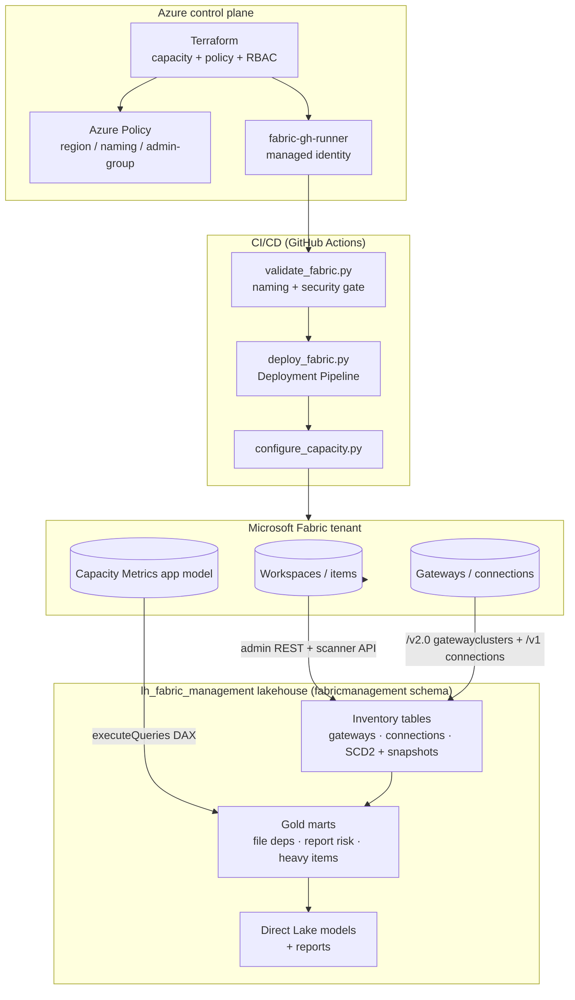

# Architecture

FabricWAF is a Well-Architected-Framework reference for governing Microsoft Fabric.
It has three pillars, each independently useful:

1. **Provisioning & policy (IaC)** — Terraform provisions Fabric capacities under
   Azure Policy + custom RBAC so capacities can only be created in approved regions,
   with compliant names, and with a locked admin group.
2. **Compliance & CI/CD** — Python tooling audits the whole tenant (naming, security,
   tenant settings, region), and a GitHub Actions gate validates prod workspaces before
   a Fabric Deployment Pipeline promotes content.
3. **Management lakehouse (observability)** — PySpark notebooks inventory the tenant's
   gateways, connections, data-source risk, and interactive resource consumption into
   the `lh_fabric_management` lakehouse, then serve it through Direct Lake models + reports.



## Pillar 1 — Provisioning & policy

Terraform (`terraform/`) creates the `azurerm_fabric_capacity`, three Azure Policy
definitions bundled into a governance initiative, a custom `Fabric Capacity
Administrator` role, and the `fabric-gh-runner` managed identity. Policy denies
non-US regions, non-compliant capacity names, and any admin list other than the
`Fabric-Capacity-Admins` group. See **[infrastructure.md](infrastructure.md)**.

## Pillar 2 — Compliance & CI/CD

Python scripts (`scripts/`) sweep the tenant for naming/security/region/tenant-setting
violations and can email results; a GitHub Actions workflow validates every prod
workspace and, only if clean, triggers a Fabric Deployment Pipeline promotion. The
runner authenticates with a VM managed identity — no secrets. See
**[governance-compliance.md](governance-compliance.md)**.

## Pillar 3 — Management lakehouse

Six notebooks (`notebooks/`) build a tenant-wide governance/observability dataset in
`lh_fabric_management`:

| Domain | Notebooks | Source APIs |
|---|---|---|
| **Gateways** | `gateway_inventory_to_lakehouse` | `/v2.0/myorg/gatewayclusters` (admin), metadata scanner |
| **Connections** | `connection_inventory_to_lakehouse` | `/v1/connections`, scanner, `List Item Connections` |
| **Governance marts** | `gold_governance_to_lakehouse` | `/admin/reports` + the connection map |
| **Performance** | `heavy_interactive_workloads_to_lakehouse` | Fabric Capacity Metrics model (DAX) |
| **Serving** | `build_semantic_model`, `build_interactive_workload_model` | Direct Lake over the gold tables |

The two dimension tables (`gateways`, `connections`) are **SCD Type 2**; bridge/usage
tables are **daily snapshots**. See **[management-lakehouse.md](management-lakehouse.md)**
for the pipelines and **[data-dictionary.md](data-dictionary.md)** for table schemas.

## Data-flow summary

```
Fabric tenant ──▶ admin REST / scanner / Capacity Metrics DAX
              ──▶ notebooks (PySpark, Fabric-admin identity)
              ──▶ lh_fabric_management  (Delta: SCD2 dims + daily snapshots + gold marts)
              ──▶ Direct Lake semantic models  ──▶ reports
```

Everything runs under a **Fabric administrator** identity; writes go to OneLake by
absolute path so no default lakehouse attachment is required. See
**[operations.md](operations.md)** for auth, run order, scheduling, and the
private-output handling.
